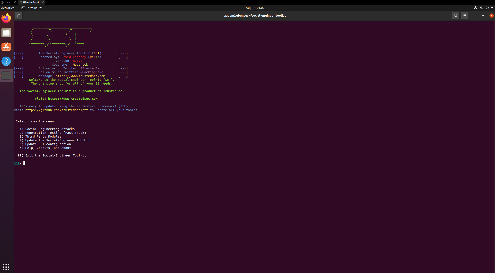
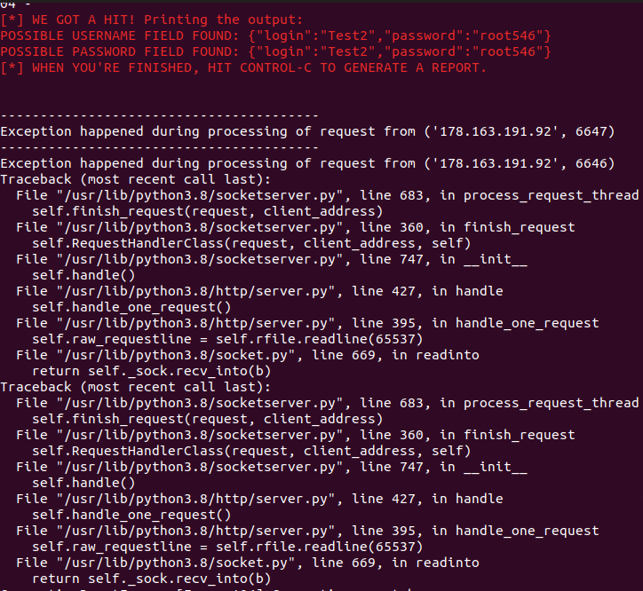

# Diplom Project TeachMeSkills

## Расследование инцидентов SOC

> Изучить логи и примеры инцидентов, дать подробные ответы на данные [вопросы SOC](https://docs.google.com/document/d/1lJBQvm5_81E1TTUOisU8RfznwZstZUcc/edit) :

Ответы:

[Link to SOC Answers](https://docs.google.com/document/d/1c1PvcNpa-UTzDevdsNDskxGlJzdrz5fv/edit)

## Создать скрипт на любом языке, который в информативном виде будет запускать скрипт с установкой:

* `AVML` - создание дампа оперативной памяти
* `Volatility` - фреймворк для работы с артефактами форензики
* `dwarf2json` - создание symbol table для кастомного ядра linux
* Сделает снимок `Debug kernel` для `symbol table`

Ответы:

## Автоматизировать процесс проверки url через virustotal

> Напишите небольшой скрипт для автоматизированной проверки url. Можно использовать любой язык программирования

Ответы:

> [Link to automatization script](bin/Script.py)

```py

import requests

# Замените 'YOUR_API_KEY' вашим фактическим API ключом
API_KEY = 'c6f262a299ec5d9295326c4dcb29bfe654648fe230b47adaf922da483687cfd7'
BASE_URL = 'https://www.virustotal.com/vtapi/v2'

def check_url(url):
    params = {
        'apikey': API_KEY,
        'url': url,
        'resource': url
    }
    
    # Отправляем запрос на проверку URL
    response = requests.get(f'{BASE_URL}/url/report', params=params)
    
    if response.status_code == 200:
        results = response.json()
        return results
    else:
        return None

def display_results(results):
    if results and 'positives' in results:
        print(f"URL: {results['url']}")
        print(f"Positive detections: {results['positives']} / {results['total']}")
        for scanner, result in results['scans'].items():
            print(f"{scanner}: {result['result']}")
    else:
        print("Результат")

if __name__ == "__main__":
    url_to_check = input("Введите URL для проверки: ")
    results = check_url(url_to_check)
    display_results(results)
```


## Вы обнаружили уязвимость [CVE-2021-41773](https://nvd.nist.gov/vuln/detail/CVE-2021-41773) на вашем web сервере

> Вам необходимо создать задачу для IT по её устранению. Что нужно будет сделать специалисту, чтобы исправить эту уязвимость? Напишите plabook для специалиста SOC L1

Ответы:

## Отправить фишинговое письмо

* Установка setoolkit на ubuntu
* Отправьте мне письмо на адрес:smilovesmirnov@gmail.com
* от имени Teachmeskills с адресом отправителя info@teachmeskills.com
* В письме пришлите ссылку, на форму - копию страницы Zoom, где хранятся видео с занятий (https://us06web.zoom.us/signin#/login),
* код которой изменен таким образом, чтобы вы смогли получить введенный мной в форму флаг.
* В тексте письма укажите своё имя и фамилию - для уточнения кто выполнил задание
* p.s. Нужно зарегистрироваться в облаке, для получения белого ip
* Для отправки письма, можете использовать emkei.cz

Scrinshots:





## ** Установить SIEM систему (на ваше усмотрение Wazuh, ELK\EFK, cloud splunk)

* Настроить логирование и отправку windows 10 логов
* Настроить логирование и отправку linux syslog / auditd